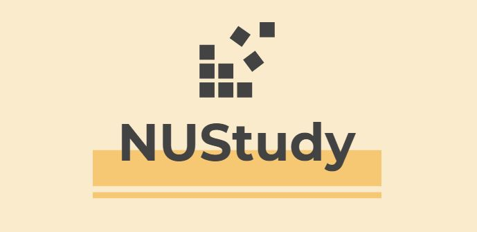

# BT3103 Final Project (NUStudy)
## By Pancakes
<p align="center">
  
</p>

NUStudy is a web application which helps students to track their progress to fulfil their degree requirements.

## Motivation
With the broad range of modules offered in NUS and the different categories of modules to fulfil (Core Modules, Programme Electives, Unrestricted Electives, General Education Modules), we realised that it could be tedious and complicated for students to track their degree progress over the course of their candidature.

We also found that there is a lack of user-friendly applications available for students to track their degree progress.

Hence, to resolve this problem, we created our NUStudy application as a user-friendly application for NUS students to track their degree progress.

## Project setup
### Install dependencies
```
npm install
```

### Compiles and hot-reloads for development
```
npm run serve
```

### Compiles and minifies for production
```
npm run build
```

### Lints and fixes files
```
npm run lint
```

### Customize configuration
See [Configuration Reference](https://cli.vuejs.org/config/).
